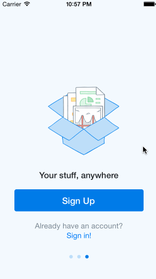

# Dropbox Log-In Flow

(Sample of your weekly project submission README)

This is a sample of the Dropbox log-in flow for iOS. All images were provided courtesy of CodePath. 

Time spent: 4.5 hours total

Completed user stories:

 * [x] Required: User can tap through the 3 welcome screens.
 * [x] Required: User can follow the create user flow.
 * [x] User can follow the sign in flow.
 * 
Notes:

I adjusted the flow a bit as it is incorrect according to the app. Hope that is okay. :)

Walkthrough of all user stories:

GIF created with [LiceCap](http://www.cockos.com/licecap/).
